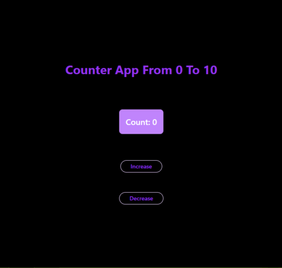

# React + Vite

# Counter App

This React component demonstrates a simple counter application.

## Demo



## Features

- **State management-**  Uses the useState hook to manage the count value.
- **Increment/decrement buttons-** Allows users to increase or decrease the count within a specified range (0 to 10).
- **Visual feedback-** Displays the current count and provides alerts for reaching the count limits.
- **Basic styling-** Employs Tailwind CSS for styling the component.


## Key Functionalities

- **Increment-** Increases the count by 1, with a maximum limit of 10.
- **Decrement-**  Decreases the count by 1, with a minimum limit of 0.
- **Error handling-**  Displays alerts when count limits are reached.

## Technologies Used
- React
- Tailwind CSS (for styling)


## Getting Started

Follow these instructions to set up and run the project locally.

### Prerequisites

- Node.js and npm installed on your machine. You can download and install them from [here](https://nodejs.org/).

### Installation

1. **Clone the Repository:**

   If you're cloning this repository from GitHub, use the following command:

   ```git clone https://github.com/yourusername/repository-name.git```

    Replace yourusername and repository-name with your actual GitHub username and the name of the repository.

2. **Navigate to the Project Directory:**

    ```cd repository-name```

3. **Install Dependencies:**

    Run the following command to install all the necessary dependencies:

    ``npm install``

4. **Running the Project**
    
    Once you have installed the dependencies, you can start the development server using the Vite command:

    ``npm run dev``

    This will open the project in your default browser, usually at http://localhost:3000.


## Customization
- **Styling:** The component can be further enhanced with additional features like animations, custom styling, and accessibility improvements.

