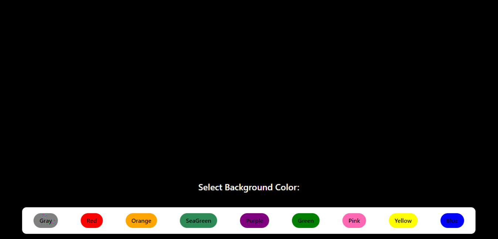

# React + Vite


# Background color Changer App
This React app allows users to dynamically change the background color of a page by selecting from a palette of colors.


## Demo


## Features

- **State management-**  Uses the useState hook to manage the color value.
- **Dynamic color selection-**  Allows users to choose from a predefined palette of colors.
- **Real-time updates-** Instantly applies the selected color to the background.
- **Intuitive user interface-** Provides an intuitive and user-friendly experience..
- **Visual Feedback-**  Provides visual cues to indicate the selected color (e.g., button color, hover effects).
- **Component Reusability-**  Can be easily integrated into different parts of an application.

## How It Works
The component utilizes the `useState` hook to manage the current background color. When a user selects a color, the state is updated, triggering a re-render and applying the new color to the background.

## Technologies Used
- React
- Tailwind CSS (for styling)

## Getting Started

Follow these instructions to set up and run the project locally.

### Prerequisites

- Node.js and npm installed on your machine. You can download and install them from [here](https://nodejs.org/).

### Installation

1. **Clone the Repository:**

   If you're cloning this repository from GitHub, use the following command:

   ```git clone https://github.com/yourusername/repository-name.git```

    Replace yourusername and repository-name with your actual GitHub username and the name of the repository.

2. **Navigate to the Project Directory:**

    ```cd repository-name```

3. **Install Dependencies:**

    Run the following command to install all the necessary dependencies:

    ``npm install``

4. **Running the Project**
    
    Once you have installed the dependencies, you can start the development server using the Vite command:

    ``npm run dev``

    This will open the project in your default browser, usually at http://localhost:3000.


## Customization

- **Colors:** Modify button values and styles to change available colors.
- **Styling:** The component uses Tailwind CSS for styling. You can customize the appearance by modifying the CSS classes.
