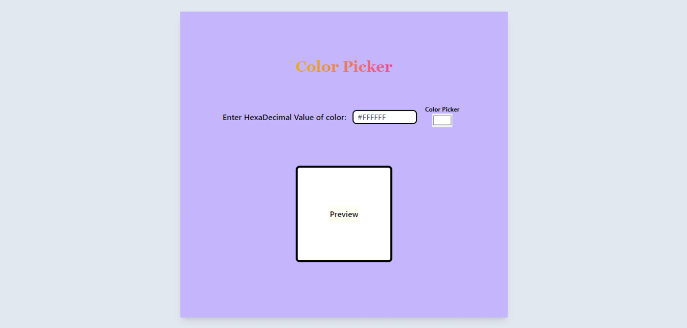

# React + Vite


# Color Picker App
This React application provides users with a convenient way to choose a color and visualize its selection through a preview box.


## Demo


## Features

- **State management-**  Leverages the useState hook to effectively manage the current color state.
- **Color Selection-**  ffers both a text input field for entering hexadecimal color values and a built-in color picker for visual selection.
- **Input Validation-** Validates user input to ensure it adheres to a valid hexadecimal format.
- **Informative Feedback-** Displays error and note messages to guide users on correct input format in case of invalid values.
- **Real-time Preview-** The chosen color instantly reflects in the preview box, providing a dynamic visual feedback for color selection.
- **Intuitive user interface-** Provides an intuitive and user-friendly experience..
- **Visual Feedback-**  Provides visual cues to indicate the selected color (e.g., button color, hover effects).
- **Component Reusability-**  Can be easily integrated into different parts of an application.

## How It Works
The core functionality relies on the `useState` hook. This hook manages the state of the selected color (color), the entered hexadecimal value (inputColor), and any error/note messages (error, note) pertaining to user input validation.

When a user interacts with either the text input or the color picker, the state is updated with the chosen value, triggering a re-render of the component. This re-render reflects the selected color in the preview box, offering immediate visual feedback to the user. Additionally, input validation ensures users adhere to the correct hexadecimal color format, providing informative feedback through error and note messages.

## Technologies Used
- React
- Tailwind CSS (for styling)
- Vite (for development server)

## Getting Started

Follow these instructions to set up and run the project locally.

### Prerequisites

- Node.js and npm installed on your machine. You can download and install them from [here](https://nodejs.org/).

### Installation

1. **Clone the Repository:**

   If you're cloning this repository from GitHub, use the following command:

   ```git clone https://github.com/yourusername/repository-name.git```

    Replace yourusername and repository-name with your actual GitHub username and the name of the repository.

2. **Navigate to the Project Directory:**

    ```cd repository-name```

3. **Install Dependencies:**

    Run the following command to install all the necessary dependencies:

    ``npm install``

4. **Running the Project**
    
    Once you have installed the dependencies, you can start the development server using the Vite command:

    ``npm run dev``

    This will open the project in your default browser, usually at http://localhost:3000.


## Customization

- **Color Validation:** You can further refine the input validation logic to handle additional color formats (e.g., RGB, HSL) if desired.
- **Styling:** Feel free to customize the look and feel of the application by modifying the CSS classes used in the code.
