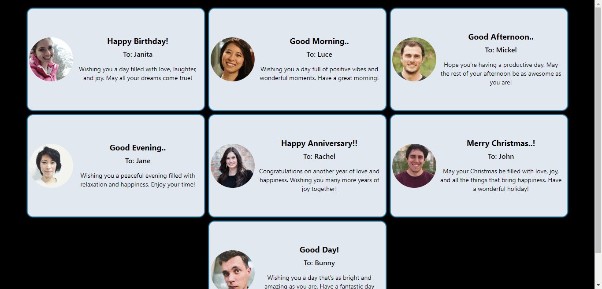

# React + Vite

# React Greeting Card App
This React application displays a series of greeting cards, each featuring a greeting message, recipient's name, image, and a personalized wish. The app is designed with a responsive layout using Tailwind CSS, ensuring that the cards are visually appealing and well-organized across different screen sizes.

## Demo

## Features
- **Responsive Design:** The layout adjusts seamlessly between different screen sizes, providing an optimal user experience on both mobile and desktop devices.

- **Dynamic Greeting Cards:** The cards are dynamically generated based on data, allowing for easy customization of the greetings, names, images, and wishes.

- **Tailwind CSS Styling:** The application utilizes Tailwind CSS for quick and efficient styling with minimal custom CSS.

## Components

- **App:** he main component that renders the greeting cards using the GreetingCard component.
- **GreetingCard:**A reusable component that displays an individual greeting card with an image, greeting message, name, and personalized wish.

## Technologies Used

- **React:** For building the user interface.
- **Tailwind CSS:** For styling and layout.
- **Vite:** For fast and efficient development.

## Getting Started

**Prerequisites**
Ensure you have Node.js and npm installed on your machine. You can download them here.

### Installation

1. **Clone the Repository:**

   If you're cloning this repository from GitHub, use the following command:

   
git clone https://github.com/yourusername/repository-name.git

    Replace yourusername and repository-name with your actual GitHub username and the name of the repository.

2. **Navigate to the Project Directory:**

    
cd repository-name

3. **Install Dependencies:**

    Run the following command to install all the necessary dependencies:

    `npm install

4. **Running the Project**
    
    Once you have installed the dependencies, you can start the development server using the Vite command:

    `npm run dev

    This will open the project in your default browser, usually at http://localhost:3000.

## Customization

- **Card Data:** You can easily customize the greeting cards by modifying the `carddata` array in `App.js` to include different greetings, names, images, and wishes.
- **Styling:** Modify Tailwind CSS classes in the component files to change the appearance of the application.